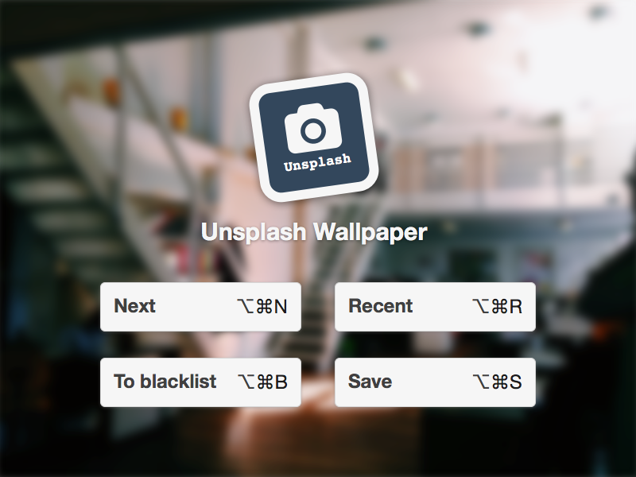
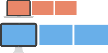

# Unsplash Wallpaper

Unsplash Wallpaper changes your desktop wallpaper to one of thousands stunning photos from [Unsplash](http://unsplash.com).

It's an old version of [Irvue](http://irvue.tumblr.com). I will not support it anymore, but this version contains some features, which can not be implemented in the Mac App Store version. So I made code of the last Unsplash Wallpaper version open for everyone.

## Requirements

* OS X 10.9+

## Features

### OS X theme depending on image

### Shortcuts

### Multiscreen/Multiworkspace support

* Change image on all workspaces:  

* Change image on current display workspaces:  

* Change image on current workspace  

### Wallpapers autoupdating

Available updating intervals:

* 3 hours
* 12 hours
* 24 hours
* Week
* Two weeks
* Month

## How to use

To make Unsplash Wallpaper work, you need to get your API key from here: [https://unsplash.com/developers](https://unsplash.com/developers).

Put your key into **UnsplashConstants.m**:

`NSString *const kUnsplashAppID = @"<your api key>";`

Then you will be able to build this app with Xcode.
